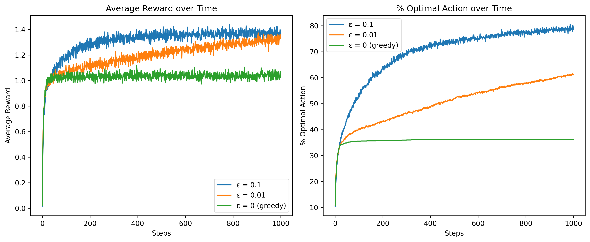
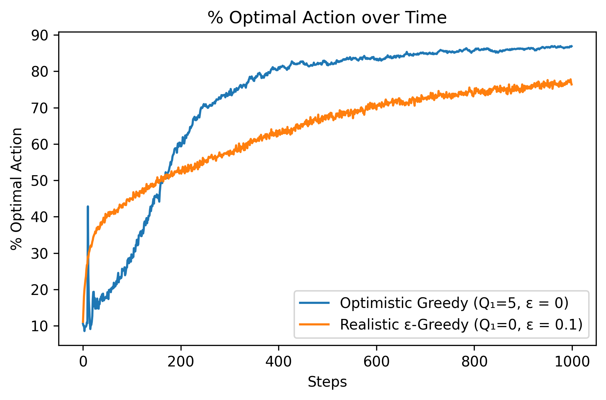
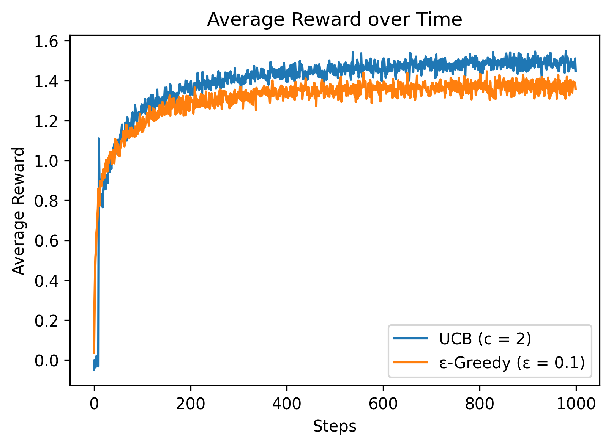
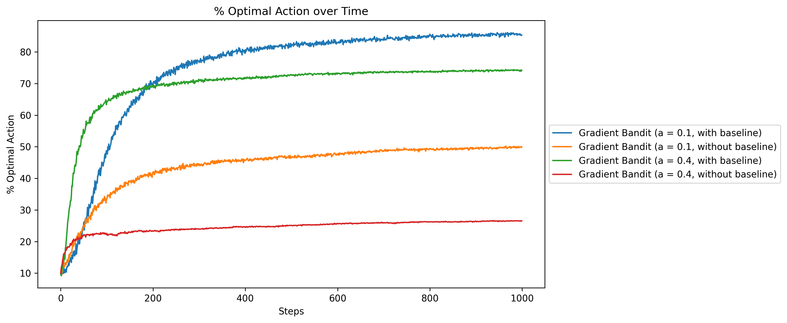
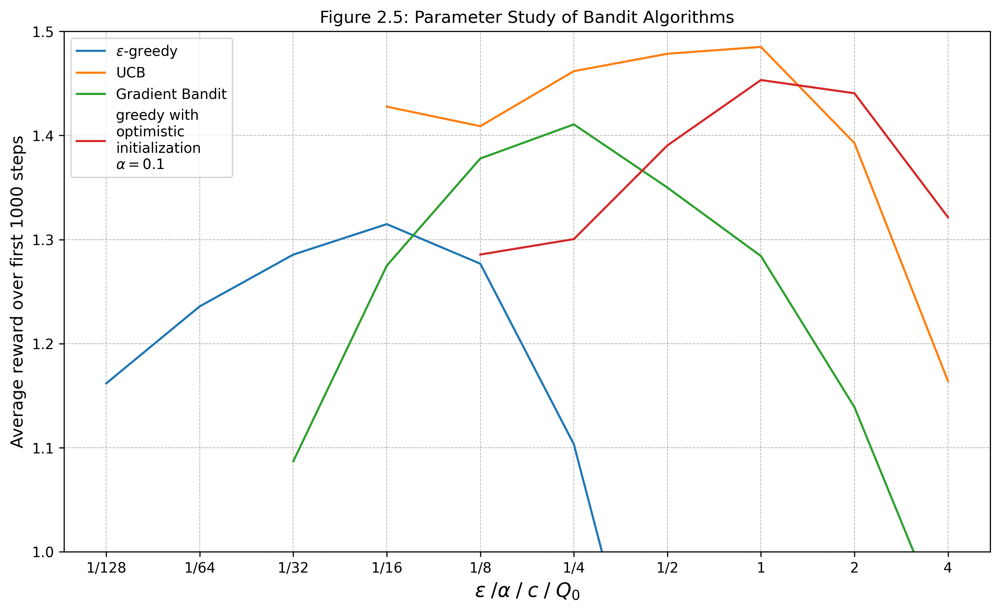
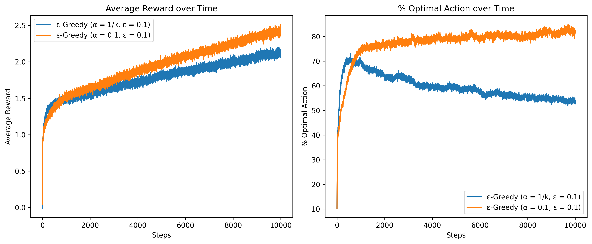

# N-Armed Bandits Simulator

Interactive simulation and comparison tool for multi-armed bandit algorithms. Includes implementations of epsilon-greedy, UCB, and gradient bandit methods on stationary and nonstationary testbeds.

Built to understand reinforcement learning fundamentals from Sutton & Barto's RL textbook (Chapter 2).

## Live Demo

**Try it here:** https://n-armed-bandit-simulator.onrender.com/

## What It Does

**Web App:** Interactive simulator with real-time Plotly visualizations comparing different exploration strategies

**Experiments:** Scripts that reproduce the classic figures from Sutton & Barto Chapter 2 (Figures 2.1-2.5)

**Library:** Modular components (agents, environments, policies, update rules) that can be imported and combined

## Quick Start
```bash
# install dependencies
poetry install

# run web app locally
poetry run python -m n_armed_bandits.api.app
# navigate to http://localhost:5000

# run specific experiment
poetry run python experiments/fig_two_one.py

# run tests
poetry run pytest
```

## Project Structure
```
src/n_armed_bandits/
├── agents/           # Algorithm implementations
│   ├── epsilon_greedy.py
│   ├── ucb.py
│   └── gradient.py
├── envs/             # Testbed environments
├── policies/         # Action selection strategies
├── updates/          # Value update methods
└── api/              # Flask web app
    ├── app.py
    ├── templates/
    └── static/

experiments/          # Sutton & Barto figure reproductions
├── fig_two_one.py    # ε-greedy comparison
├── fig_two_two.py    # Optimistic initialization
├── fig_two_three.py  # UCB vs ε-greedy
├── fig_two_four.py   # Gradient bandit with/without baseline
└── fig_two_five.py   # Parameter study across all methods
```

## Web App Features

- Select algorithm (ε-greedy, UCB, gradient)
- Choose environment (stationary/nonstationary)
- Tune hyperparameters (ε, α, c, Q₀)
- Live plots: average reward and % optimal action over time
- Runs 50 independent simulations and averages results

## Design Decisions

**Modular architecture:** Separated concerns (policy selection, value updates, environment) so components can be mixed and matched

**Agent abstraction:** All agents inherit from base `Agent` class with `select_action()` and `update()` methods

**Testbed API:** Environments expose `get_reward(action)` and `get_optimal_action()` for consistent evaluation

**Web app separation:** Core library has zero Flask dependencies; app is just a thin wrapper that calls library functions

## Experiment Results

All experiments output PNG figures to `experiments/results/`:

### Figure 2.1: ε-Greedy Comparison
Compares different epsilon values on the stationary 10-armed testbed. Higher ε explores more but converges to suboptimal policy. Lower ε exploits early estimates.



### Figure 2.2: Optimistic Initialization
Shows how optimistic initial values (Q₀ = 5) encourage exploration even with greedy policy (ε = 0). Early disappointment drives exploration.



### Figure 2.3: UCB vs ε-Greedy
UCB outperforms ε-greedy by using uncertainty estimates to guide exploration. Initial spike at step 11 occurs after all arms have been tried once.



### Figure 2.4: Gradient Bandit with/without Baseline
Demonstrates importance of reward baseline in gradient bandit algorithm. Without baseline, algorithm struggles to distinguish good from bad rewards.



### Figure 2.5: Parameter Study
Compares all algorithms across different hyperparameter settings. Shows optimal parameter ranges and relative performance.



### Exercise 2.4: Nonstationary Problems
Shows why constant step-size (α = 0.1) outperforms sample-average (α = 1/k) on nonstationary problems where action values perform random walks.



## Environments

**Stationary Testbed:** Action values q*(a) drawn from N(μ, σ²), rewards are q*(a) + noise

**Nonstationary Testbed:** Action values perform random walks each step

## Algorithms Implemented

### ε-Greedy

**How it works:** With probability ε, select a random action (explore). Otherwise, select the action with highest estimated value (exploit).

**Action selection:**
```
A_t = argmax Q_t(a)  with probability 1-ε
      random action   with probability ε
```

**Value update:**
```
Q_{n+1}(a) = Q_n(a) + α[R_n - Q_n(a)]
```

**Key parameters:**
- `ε` (epsilon): exploration rate
- `α` (alpha): step-size (None = sample average)
- `Q₀`: initial estimates (optimistic initialization encourages exploration)

**When to use:** Simple, reliable baseline. Works well when you know the problem is roughly stationary.

---

### Upper Confidence Bound (UCB)

**How it works:** Select actions based on their potential to be optimal, balancing estimated value and uncertainty.

**Action selection:**
```
A_t = argmax [Q_t(a) + c√(ln(t) / N_t(a))]
```
where:
- `Q_t(a)`: estimated value of action a
- `N_t(a)`: number of times action a has been selected
- `c`: exploration parameter (controls degree of exploration)
- `t`: current time step

**Key parameters:**
- `c`: exploration factor (higher = more exploration)
- `α`: optional constant step-size for nonstationary problems

**When to use:** Better than ε-greedy when you want principled exploration that automatically decreases uncertainty. Performs well on stationary problems.

**Note:** The √(ln(t)/N_t(a)) term is the "uncertainty bonus" - unvisited actions get infinite bonus, encouraging exploration.

---

### Gradient Bandit

**How it works:** Learns action *preferences* H_t(a) instead of value estimates. Actions are selected via softmax probability distribution.

**Action probability:**
```
π_t(a) = exp(H_t(a)) / Σ_b exp(H_t(b))
```

**Preference update:**
```
H_{t+1}(A_t) = H_t(A_t) + α(R_t - R̄_t)(1 - π_t(A_t))       # selected action
H_{t+1}(a)   = H_t(a)   - α(R_t - R̄_t)π_t(a)              # all other actions
```
where `R̄_t` is the average reward baseline.

**Key parameters:**
- `α` (alpha): learning rate for preference updates
- `use_baseline`: whether to use reward baseline R̄_t (recommended: True)

**When to use:** Works well when rewards are shifted or scaled. The baseline helps deal with non-zero mean rewards. Good for problems where relative action preferences matter more than absolute values.

**Why baseline matters:** Without baseline, algorithm can't distinguish "good" from "bad" rewards - all positive rewards increase preference equally.

---

### Shared Features

All algorithms support:

**Sample-average updates (α = 1/N):**
- Averages all past rewards equally
- Optimal for stationary problems
- Memory of all previous rewards

**Constant step-size (α = const):**
- Recent rewards weighted more heavily: Q_n = (1-α)^n Q_0 + Σ_{i=1}^n α(1-α)^{n-i} R_i
- Essential for nonstationary problems (when true values drift)
- Forgets distant past exponentially

**Optimistic initialization (Q₀ > 0):**
- Initialize all Q values above expected reward
- Forces exploration early (all actions look disappointing at first)
- "Optimism in the face of uncertainty"
- Works best with greedy/UCB policies

## Built With

- Python 3.13
- NumPy (vectorized operations)
- Matplotlib (static plots for experiments)
- Flask + Plotly (interactive web visualizations)
- Poetry (dependency management)

## References

Based on: *Reinforcement Learning: An Introduction* (2nd Edition) by Sutton & Barto, Chapter 2
